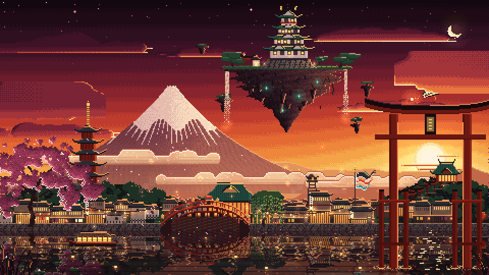

# Japanese fantasy city



A seamless 10 second pixel art loop (200 frames at 20 fps). It is drawn natively at 480x270 and nearest-neighbour upscaled to 960x540. Both versions are included:

- `japanese_fantasy_city.gif`: 960x540, for viewing
- `japanese_fantasy_city_1x.gif`: 480x270, the native pixels

## What is in the scene

- Sunset sky with dithered gradient, twinkling stars, crescent moon with earthshine, a shooting star
- A jade dragon chasing a flaming pearl, bursting out of one cloud bank and diving into another
- Floating island with a copper-roofed castle, golden shachihoko that glint, pines, a shrine, waterfalls dissolving into spray, pulsing spirit crystals and orbiting rocks
- Snow-capped mountain with ravine streaks, pale kasumi mist bands in the style of folding screens
- Five-storey pagoda with glinting wind bells, a hilltop shrine with a path of small torii
- Three depth rows of town: machiya, storehouses with namako walls, inns with balconies, a temple, fire lookout tower, koinobori with a spinning pinwheel, chimney smoke, swaying lanterns
- Vermilion drum bridge whose reflection closes into a circle, a willow in the wind, a sakura shedding petals
- River with wobbling reflections, a sun glitter path, drifting toro nagashi lanterns, a moored yakatabune, a fisherman's sampan
- Giant Itsukushima-style torii standing in the water, rim-lit by the sun it frames, with ripples at its legs
- Cranes, fireflies, rising lanterns, lotus pads and reeds in the foreground

## Rebuilding

Everything is procedural Python (no image assets). Every animation is periodic in the frame count, so the loop has no seam.

```
pip install numpy pillow scipy
python3 src/render.py
```

The renderer builds one global 255-colour palette (with accent hues pinned) and writes delta-encoded frames, so only changed pixels are stored per frame.
