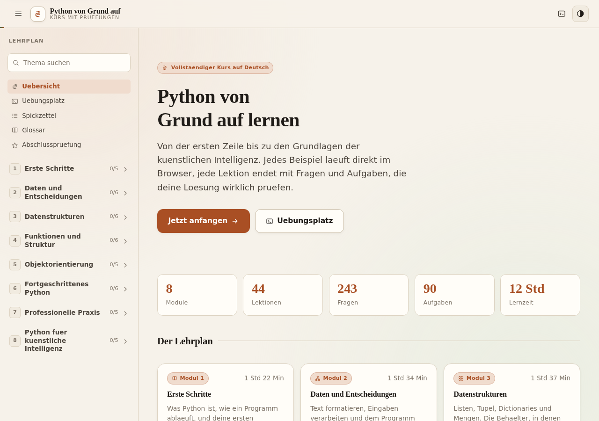
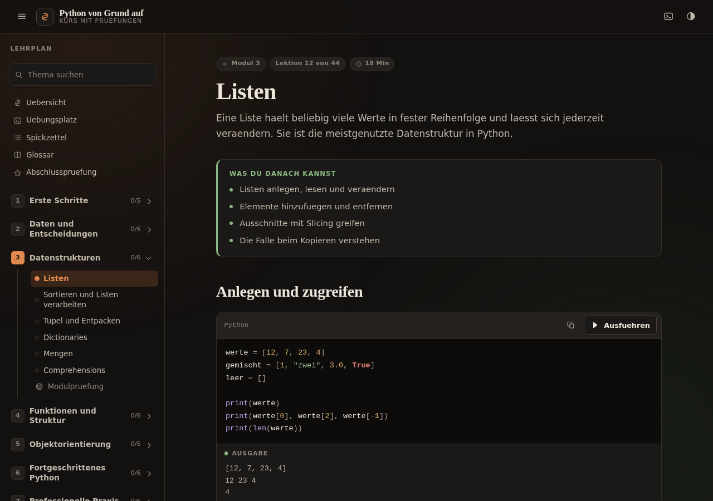
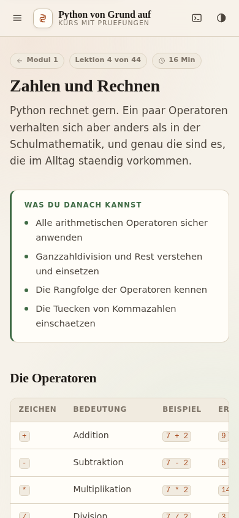

# Python von Grund auf

Ein vollstaendiger Python-Kurs auf Deutsch als **eine einzige HTML-Datei**.
Von der ersten Zeile bis zu den Grundlagen der kuenstlichen Intelligenz.

**Zum Lernen:** [`dist/python-kurs.html`](dist/python-kurs.html) herunterladen und
im Browser oeffnen. Sonst wird nichts gebraucht.



## Was drin ist

| | |
|---|---|
| Module | 8 |
| Lektionen | 44 |
| Verstaendnisfragen | 243 |
| Programmieraufgaben | 90 mit 405 Pruefschritten |
| Lernzeit | rund 12 Stunden |
| Umfang | 343.000 Zeichen Lehrtext |

Jedes Codebeispiel laesst sich auf Knopfdruck ausfuehren. Dahinter laeuft ein
echter Python-Interpreter im Browser, der beim ersten Klick einmalig nachgeladen
wird. Jede Aufgabe wird durch echte Testschritte geprueft, nicht durch einen
Textvergleich.

## Der Lehrplan

1. **Erste Schritte** Interpreter, Ausgabe, Fehler lesen, Variablen, Zahlen, Text
2. **Daten und Entscheidungen** f-Strings, Eingaben, Wahrheitswerte, Bedingungen, Schleifen
3. **Datenstrukturen** Listen, Sortieren, Tupel, Dictionaries, Mengen, Comprehensions
4. **Funktionen und Struktur** Funktionen, Parameter, Gueltigkeit, Fehler, Module, Dateien
5. **Objektorientierung** Klassen, Vererbung, Sondermethoden, Dataclasses, Entwurf
6. **Fortgeschrittenes Python** Generatoren, Closures, Dekoratoren, Kontextmanager, Typen, Muster
7. **Professionelle Praxis** Testen, Projekte, Nebenlaeufigkeit, Geschwindigkeit, Stil
8. **Python fuer KI** NumPy, pandas, die noetige Mathematik, ein Perzeptron, Gradientenabstieg

Dazu Uebungsplatz, Spickzettel, Glossar, Modulpruefungen und eine Abschlusspruefung.

## Eigenschaften

- Folgt automatisch dem hellen oder dunklen Schema des Systems, laesst sich aber umstellen
- Fuer das Telefon gebaut, nicht nur dafuer angepasst
- Der Fortschritt wird im Browser gespeichert
- Volltextsuche ueber alle Lektionen
- Ruecksichtnahme auf `prefers-reduced-motion`
- Keine Abfrage persoenlicher Daten, keine Anmeldung, keine Verfolgung



## Selbst bauen

Der Kurs wird aus getrennten Quelldateien zu einer HTML-Datei zusammengesetzt.

```
./alles.sh
```

Das prueft die Inhalte, fuehrt jede Musterloesung gegen ihre eigenen
Pruefschritte aus, vergleicht jede hinterlegte Beispielausgabe mit der echten
Ausfuehrung und baut danach `dist/python-kurs.html`.

### Aufbau

```
src/
  index.html          Geruest und Sinnbilder
  css/                Farben, Aufbau, Bausteine, Editor, Bewegung
  js/                 Werkzeuge, Markup, Syntaxfarben, Speicher, Laufzeit,
                      Editor, Quiz, Aufgaben, Suche, Ansichten, Pruefung, Router
  inhalt/             _bausteine.js, modul-01 bis modul-08, extras, register
build.py              setzt alles zu einer Datei zusammen
pruefe.js             prueft die Inhalte auf Vollstaendigkeit
pruefe_loesungen.py   fuehrt jede Musterloesung gegen ihre Tests aus
pruefe_beispiele.py   vergleicht jede Beispielausgabe mit der Wirklichkeit
pruefe_browser.js     prueft die Oberflaeche in einem echten Browser
pruefe_python.js      prueft die Python-Ausfuehrung im Browser
```

### Pruefstand

```
./alles.sh              Inhalte, Loesungen, Beispiele, Bau
node pruefe_browser.js  47 Pruefungen der Oberflaeche, hell, dunkel und mobil
node pruefe_python.js   Ausfuehrung, Aufgabenpruefung, Fehler, Zeitlimit
```

Fuer die beiden Browserpruefungen wird `playwright` gebraucht.


